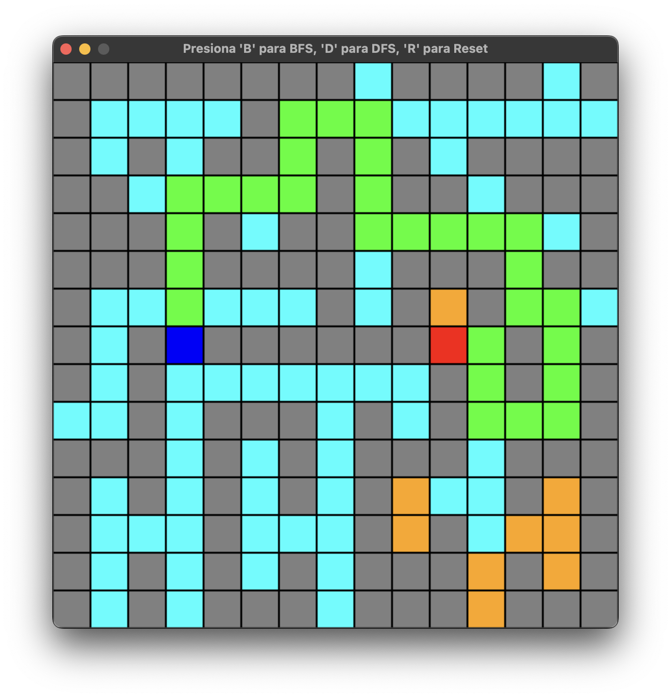

# 🔍 Algorithms BFS & DFS Visualization


Una aplicación interactiva desarrollada en **Python** y **Pygame** para visualizar el funcionamiento interno de los algoritmos de búsqueda no informada: **Breadth-First Search (BFS)** y **Depth-First Search (DFS)**.

Este proyecto tiene como objetivo demostrar gráficamente cómo estas estrategias de exploración recorren un espacio de estados (mapa de cuadrícula) para encontrar un camino desde un punto de inicio hasta un objetivo.

---

## 📸 Visualización
> 

> 

El mapa utilizado es una cuadrícula de **15x15**, donde:
* 🟦 **Azul:** Punto de Inicio.
* 🟥 **Rojo:** Punto Objetivo.
* 🟧 **Naranja/Beige:** Camino libre.
* ⬛ **Gris:** Paredes (Obstáculos).
* 🟦 **Cyan:** Nodos explorados/visitados.
* 🟩 **Verde:** Camino óptimo encontrado.

---

## 🧠 Conceptos Teóricos

### 🌊 BFS (Breadth-First Search - Búsqueda en Anchura)
Es un algoritmo de recorrido que explora todos los nodos vecinos a la profundidad actual antes de pasar a los nodos del siguiente nivel de profundidad.
* **Estructura de Datos:** Utiliza una **Cola (Queue)** (FIFO - First In, First Out).
* **Comportamiento Visual:** Se expande como una "onda" uniforme desde el inicio.
* **Propiedad:** Garantiza encontrar el camino más corto en grafos no ponderados.

### ⛏️ DFS (Depth-First Search - Búsqueda en Profundidad)
Es un algoritmo que explora tanto como sea posible a lo largo de cada rama antes de retroceder (backtracking).
* **Estructura de Datos:** Utiliza una **Pila (Stack)** (LIFO - Last In, First Out) o recursión.
* **Comportamiento Visual:** Tiende a alejarse rápidamente del inicio, explorando caminos largos y serpenteantes.
* **Propiedad:** No garantiza el camino más corto, pero puede ser más eficiente en memoria en ciertos escenarios.

---

## 🚀 Instalación y Ejecución

Sigue estos pasos para ejecutar el proyecto en tu entorno local:

### 1. Clonar el repositorio
```bash
git clone https://github.com/JesusCarramza/Algorithms_bfs_and_dfs.git
```

### 2. Configurar el entorno (Opcional pero recomendado)
```bash
# Windows
python -m venv venv
.\venv\Scripts\activate

# Mac/Linux
python3 -m venv venv
source venv/bin/activate
```

### 3. Instalar dependencias
```bash
pip install -r requirements.txt
```

### 4. Ejecutar la aplicación
```bash
python main.py
```

---
## 🎮 Controles de la Aplicación

Una vez iniciada la ventana de Pygame, puedes interactuar con el teclado usando las siguientes teclas:

| Tecla | Acción        | Descripción                                 |
|-------|--------------|--------------------------------------------|
| **B** | Iniciar BFS  | Ejecuta la Búsqueda en Anchura.           |
| **D** | Iniciar DFS  | Ejecuta la Búsqueda en Profundidad.       |
| **R** | Reset        | Limpia el mapa y reinicia el estado.      |
